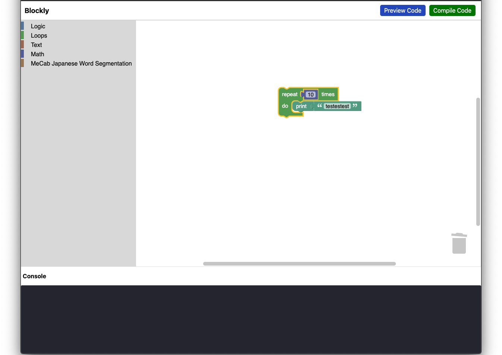

# blockly-react-sample [](https://github.com/google/blockly)

This sample shows how to load Blockly in a [React](https://reactjs.org/) project.



## Running the blockly-react

### Require Component
- Nodejs
- npm

### Dependencies installation

```
npm install
```

### Running at local

```
npm start
```

### Browse

Open [http://localhost:3000/](http://localhost:3000/)

## Community projects

[react-blockly](https://github.com/nbudin/react-blockly):
A React component that embeds Blockly. It uses the official [Blockly npm package](https://www.npmjs.com/package/blockly).


## Add Custom Block
### Essential files
1. App.js
2. customblock.js
3. generator.js

### App.js
A main webpage of web-application. Blockly workspace is rendered here
including another components. At ***WorkspaceComponent*** variable contains
a blockly workspace html, add a new block tag here as example

### customeblock.js
A custom block defenition from JSON obect (shape, connection, input, output etc)
For easier define a new block, please use [Google Blockly Factory](https://blockly-demo.appspot.com/static/demos/blockfactory/index.html) to create a new block. The tool provide GUI for block definition
and JSON's block attribute on the right side. You can copy and create a initialize function
accordinly to example

### generator
How the specific defined block is translated to code (either Javascript, Python, Lua etc). The generated code is in string. return compoenent depends on block type (eg. left connector block may return code and its value). [Google Blockly Factory](https://blockly-demo.appspot.com/static/demos/blockfactory/index.html) also provides a generator when using its GUI to define a block in **geneator stub** tab

